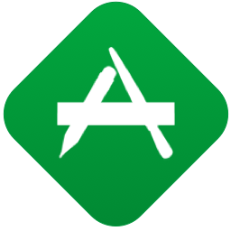

<h1 align=center><br/>OCSlimProject</h1>


###OCSlimProject is a CocoaPod for iOS and macOS that lets you creat fast, rock solid, automated *Acceptance Tests* with Fitnesse. 


###[Fitnesse](http://fitnesse.org) is a powerful and fully integrated standalone wiki and acceptance testing framework designed for ATDD and BDD style software development.

--

[](https://travis-ci.org/paulstringer/OCSlimProject)
[](http://cocoapods.org/pods/OCSlimProject)
[](http://cocoapods.org/pods/OCSlimProject)
[](http://cocoapods.org/pods/OCSlimProject)

### Usage
To run the example clone the repo, and run `pod install` in the Example directory. Open the OCSlimProject.xcworkspace file for examples of Mac and iOS Acceptance Test targets integrated into boiler plate Xcode projects.

### Requirements
- Xcode 7
- CocoaPods
- [Java 1.8](http://www.oracle.com/technetwork/java/javase/downloads/jre8-downloads-2133155.html) (required for Fitnesse)
- [ios-sim](http://github.com/phonegap/ios-sim)
- [Node.js](http://blog.teamtreehouse.com/install-node-js-npm-mac) (required for ios-sim)


## How it Works
OCSlimProject works by creating a seperate target of your app. This *'Acceptance Tests'* target is one that only includes your apps business logic code + simple 'fixtures'. 

Fixtures are glue code you write in Swift or Obj-C that provide a thin wrapper around your App's business logic that is an integration point between it and Fitnesse. Think of it together with Fitnesse as an alternative UI for using your App.  As such fixtures (just like View Controllers) should be nothing more than very simple classes that delegate calls to and from your business logic code (sometimes known as 'Model' code).

Fitnesse communicates with your App using a communications protocol called [Slim](http://fitnesse.org/FitNesse.UserGuide.WritingAcceptanceTests.SliM.SlimProtocol) (Simple List Invocation Method). The work of implementing this protocol is provided via the [cslim project](https://github.com/dougbradbury/cslim) which contains an [Objective-C](https://github.com/ericmeyer/ObjectiveCSlim) implementation written by Erik Myer. 

When writing fixtures in Swift this requires your fixtures are subclasses of NSObject. 

----

#Get Started

###OCSlimProject is available to your own projects through [CocoaPods](https://cocoapods.org/?q=OCSlim). It is designed to be integrated through Xcode Templates. These templates encapsulate the work of integrating your App with Fitnesse. 

## 1. Install the Templates

* Download [OCSlimProjectXcodeTemplates](https://github.com/paulstringer/OCSlimProjectXcodeTemplates) from GitHub and run *make*

```
$ git clone https://github.com/paulstringer/OCSlimProjectXcodeTemplates.git
$ cd OCSlimProjectXcodeTemplates
$ make
```

This adds the Xcode project templates for creating Acceptance Test targets within Xcode for iOS & OS X. These are installed at *~/Library/Developer/Xcode/Templates/Test*.

* Navigate to the *'Test'* section of Xcode's *'New Target'* setup. In both iOS and OS X you will see two new types of testing target:
	* Acceptance Tests
	
	> This target builds an iOS/OS X Application for Acceptance Testing your App using the Fitnesse framework. Requires a project that uses CocoaPods.
	
	* Acceptance Unit Tests Bundle

	> This target builds an iOS/OS X unit test bundle that generates results from your Acceptance Tests target using Fitnesse and then reports them within Xcode as XCTest results.
	
## 2. Add 'Acceptance Tests' Targets to your Project

###Creating an 'Acceptance Tests' target is the next step. After following this step your ready to begin writing acceptance tests.

>You will need to have installed both Node.js (via Homebrew works well) and ios-sim to run iOS based Acceptance Tests. Instructions are included and are straight forward.

* Add an 'AcceptanceTests' target to your Project using the 'Acceptance Tests' templates. Templates are available for both iOS and OS X. OS X targets run faster, iOS targets allow you to use classes with dependancies on UIKit.

* Using CocoaPods link OCSlimProject to your 'AcceptanceTests' target with the following Podfile entry
    
	```
    target 'AcceptanceTests' do
        platform :ios, 9.0
	    pod 'OCSlimProject'
    end
	```
* Run either ```pod install``` or ```pod update``` as necessary

* Build the 'AcceptanceTests' target to generate the App (repeat this after code changes)

* Launch Fitnesse by running the script ```./LaunchFitnesse``` in your project's root directory

* Follow the prompt to download [Java 1.8](http://www.oracle.com/technetwork/java/javase/downloads/jre8-downloads-2133155.html) if needed.

* Now with Fitnesse running, check out the [example](http://localhost:8080/OCSlimProjectExamplePage) and run the tests

	*Check for any errors in the 'Execution Log' and install Node.js and ios-sim as instructed*


**Congratulations** - You're now ready and setup to begin writing rock-solid, blazing fast [Acceptance tests and Fixtures](http://stringerstheory.net/acceptance-testing-with-ios/) for iOS and macOS apps.


## Integrating with XCTest using 'Acceptance Unit Tests Bundle'

###OCSlimProject integrates seamlessly into your development and CI worfklows by supporting XCTest. Quickly run and see reports of your Fitnesse Acceptance Test results within Xcode or with xcodebuild.

* Add an 'AcceptanceUnitTests' target to your Project using the 'Acceptance Unit Test Bundle' template.

* Enter 'OCSlimProjectExamplePage' as the 'Fitnesse Suite Page Name' in the project settings.

* Edit your Podfile and add the following Podfile entry
    
	```
    target 'AcceptanceUnitTests' do
        platform :ios, 9.0
        pod 'OCSlimProjectTestBundleSupport'
    end
	```
* Run ```pod update```

* **IMPORTANT** Add your 'AcceptanceTests' main target as a 'Target Dependancy' of this target in Build Phases. (This ensures that it is built prior to the tests being run and ensure your results are based on the latest code.)

* Hit CMD-U and verify your Acceptance Tests run and display the same results seen when running in Fitnesse.

### Finally 

* Add the 'AcceptanceUnitTest' target to the test phase of any schemes where you want the Acceptance Tests to be run as part of your develop and test workflow. E.g. Add 'AcceptanceUnitTest' to the test phase of your apps target to have acceptance tests run at the same time as running your regular unit tests.
	
*The template you choose initially should match the original platform of the Acceptance Test target. E.g. if you have an iOS Acceptance Tests app, use the iOS Acceptance Unit Test Bundle*
 
#### Known Xcode 8 / CI Integration Issue

Due is an abnormally long delay in starting a simulator from a fresh image of macOS 10.12 beta with Xcode 8 there is a known issue when integrating with CI systems likes Travis. (It can be assumed this likely affects other CI systems that use fresh VM images for each integration.)

```
** CI System Script **
xcodebuild -workspace <Workspace> -scheme <AcceptanceUnitTestBundleScheme> -destination 'platform=iOS Simulator,name=iPhone 6s' test

** TEST FAILED **
The command "set -o pipefail && xcodebuild -workspace <Workspace> -scheme <AcceptanceUnitTestBundleScheme> -destination 'platform=iOS Simulator,name=iPhone 6s' test" exited with 65.
```

The error reveals itself as a failure when attempting to run iOS based 'Acceptance Unit Test Bundles' as seen in the example. Investigation seems to point to it being the result of XCTest timing out waiting for a Build Phase responsible for generating the Fitnesse Test Results. This itself is dependant on starting the Simulator.

**Workaround**

A workaround is simply to run some other Unit Tests first before running your scheme. Typically this will involve just ensuring your actual Unit Tests have been run first. This primes the Simulator so that when Fitnesse comes to use the simulator it's responsive. 

Check out the [Travis Configuration](.travis.ynl) of this project for an example.


--- 

# Acknowledgements
The owner of this repository takes no credit for the following included resources (except for the ones credited to the owner). This is a convienient lightweight wrapper either inspired by or using these resources together with some project glue. The aim has been to automate the process of setting up Xcode projects so as to more easily be able to use 'ocslim' and integrate with Fitnesse. 

### Fitnesse
Created by: Robert Martin, Micah Martin & Fitnesse.org contributors.

<http://fitnesse.org>

### OCSlim, RunTestsTargetWithSlimPort
Created by: Erik Meyer, Doug Bradbury, 8th Light.

<https://github.com/ericmeyer/ObjectiveCSlim>

<https://github.com/dougbradbury/cslim/tree/ocslim>

### ios-sim
Created by: Phonegap

<https://github.com/phonegap/ios-sim>

### exportenv.sh
Created by: Jon Reid

<https://github.com/jonreid/XcodeCoverage>

### Xcode Project Templates, OCSlimProjectTestBundleSupport, LaunchFitnesse
Created by: Paul Stringer

<https://github.com/paulstringer/OCSlimProject>


### License
OCSlimProject is available under the MIT license. See the LICENSE file for more info.
